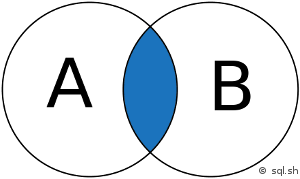

```sql
SELECT *
FROM tableA
INNER JOIN tableB ON tableA.id = tableB.fk_id
```

On récupère ce qui se trouve à l'intersection des deux tables ou plutôt ce qui est lié dans les deux tables par le lien fait au dessus
