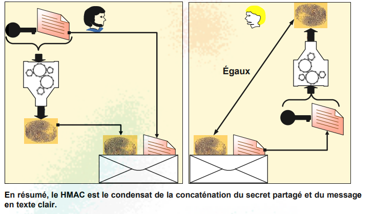
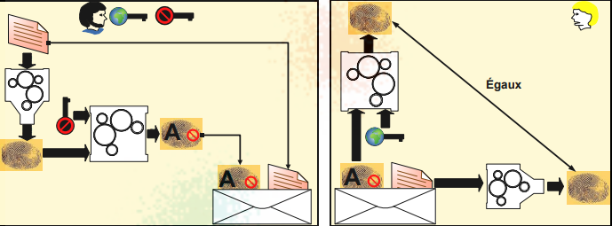

#Cryptographie : Ensemble des procédés visant à crypter des informations pour en assurer la confidentialité entre l'émetteur et le destinataire.

**Grec :**

Première Méthode de Cryptographie La Scytale spartiate chiffrement par transposition

**Romain :**

Chiffrement par substitution voir code césar
on décale le texte d'un certain nombre de caractère.

#Stéganographie : Dissimuler un document dans un autres document.

Premier exemple de Stéganographie cacher graver sur une plaque de roche un message puis mettre couche d'argile et écrire un texte lambda

#Watermarking : ne s'applique qu'aux objets numériques. Il consiste à insérer une marque dans un objet numérique

enjeux : CIA

- Confidentialité {confidentiality,privacy}
- Intégrité des données {data integrity}
- Authentification/authenticité {authentication}
- Non répudiation {nonrepudiation} \*(ex : Signature numérique)

# Techniques de Cryptographie moderne :

## Chiffrement Irréversible _(ex : Fonction de Hash peut importe la taille du fichier l'empreinte fais la même taille)_ ^20214f

- Sensibilité au message original
  - Resistance au collision : pas le même hash pour 2 fichier de même taille
  - Irréversibilité
- Exemple de Fonction de hachage :
  MD5 Empreinte de 128 bits premier problème en 1996 des gens on généré des mdp avec le même HASH que certain mdp
  SecureHashAlgorithm-1 de 160 bits
  SHA-2 va de 224 bits à 512 bits de longueur
  RIPEMD {RACE Integrity Primitives Evaluation Message Digest}
  WHIRPOOL 512 bits condensat
  - Intégrité des données
  - Sécurité des mots de passe : stockage des condensats dans une "table de mots de passe"
- Et avec du Sel alors ? - en base de donnés on se retrouve avec le sel la fonction cryptographique en clair et le mot de passe HASHÉ - le sel est ajouter avant de balancer le mdp dans la fonction cryptographique - en sortie de fonction on retrouve un message à la forme \$fonction\$SEL\$MOTDEPASSEHASHÉ

## Chiffrement réversible

- Chiffrement Symétrique
  - same hat ? same hat !
  - Souvent dans le nom on retrouve le E de "Encryption"
  - ECB : on sépare en block de 128bits un fichier et on encrypte chaque block avec la même clé et on rassemble le tout dans un fichier qui fais la même taille mais encrypté
  - [[XOR]] de chaque partie puis ajout
  - CBC =Vecteur d'initialisation puis [[XOR]] de chaque partie avec sa suivante avant le chiffrement
  - Stream Cipher avec un Vecteur d'initialisation et une clé on créé une fumée sur la quel on [[XOR]] le flux de données ici des input de clavier
  - AES algorithme de Rijndael
  - Préférable de coupler AES avec un autre comme CBC,CCM ou GCM

## Chiffrement asymétrique

- on chiffre le doc avec la clé publique de quelqu'un pour que la personne puisse la déchiffré avec sa clé privé pour garantir la confidentialité
  - Si on chiffre avec la clé privé de quelqu'un et que on le décrypte avec sa clef privé on sait qui l'envoie. Authentification !
  - Longueur de la clé de 512 a 4096
  - Sureté RSA
  - Plus lent
  - RSA faiblesse de sécurité devrait être remplacer dans le temps par
  - ECC{Elipric-Curve Cryptograohy} Basé sur les corps de Gallois ou corps fini. Clé plus courte et pour un même niveau de sécurité
  - Echange de clé Diffie-Hellman
    - Principe de Secret Partagé
    - p : très grand nombre premier et positif
    - g : très grand entier positif < p
    - il se le partage
    - Roméo choisi son secret Xr
    - Juliette choisis le sien Xj
    - Roméo va calculer Pr = g^Xr mod p
    - Juliette va calculer Pj = g^Xj mod p
    - il échange leur résultat
    - Roméo calcule sa clé Kr = Pj^Xr mod p
    - Juliette calcule sa clé Kj = Pr^Xj mod p
    - au final K = Kr = g^XjXr mod p
- Authentification et Intégrité

  - HMAC {Hashed-base Message Authentication Code}: Secret Partagé +hachage
  - HMIC {Hashed-base Message Integration Code} :
    

  - Signature numérique :

- Chiffrement sans clé
- Chiffrement avec clé
- Chiffrement par flot
- Chiffrement par block

Autorité de certification

# Résumé

## Résumé

### Résumé

#### Résumé

##### Résumé

###### Résumé

HD = HASH or DIGEST = Asymétrique
E = Encryption = symétrique (il y a RC aussi) {DES, AES, SEAL }

RSA est remplacé par Elyptique Curve Cryptographie

DH permet un secret partagé

HMAC/HMIC
