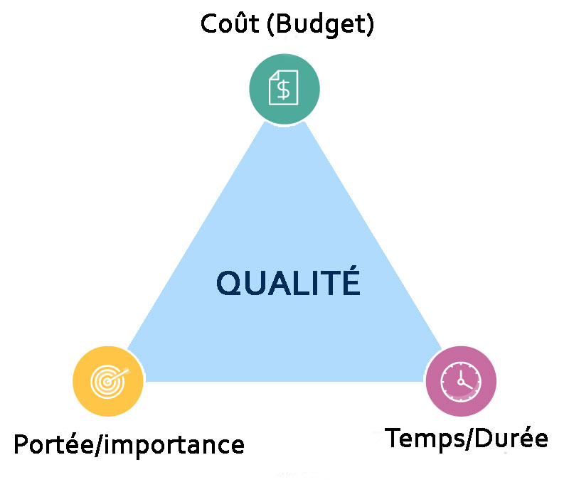

1. Le contexte du projet
   Projet : un projet est une initiative limitée dans le temps, entreprise dans le but de créer un produit, un service ou un résultat unique.
   Il est différent d'une opération ou d'un processus récurrent.
   Le but étant d'atteindre les objectifs fixés et de réaliser le bénéfice attendu en créant de la valeur.

   Pour schématiser nous pouvons dire que la conduite de projets est représentée par un triangle d'or ou la triple contrainte qui met en avant 3 principales contraintes de gestion de projet, à savoir :
   

2. Structurer le projet
   Les outils de structuration
   Le processus de structuration
   Processus
   La préparation
   Cette phase marque le début du projet et son objectif est de définir le projet dans ses grandes lignes, les enjeux
   Fondation du projet
   Objectif : Justifier le projet, Déléguer le projet à l'équipe, Elaborer le cahier des spécifications, Lancer le projet
   Justifier : Donner du sens et créer le premier doc sur le quel est basé le reste
   Déléguer le projet : Demandeur -> Chef de projet  
    La planification
   Cette phase est la clé d'une gestion de projet réussie et se concentre sur l'élaboration d'une feuille de route que tout le monde suivra. Elle commence généralement par la fixation d'objectifs et du périmètre du projet et se termine par l'élaboration d'un plan du projet.
   L'exécution
   Après avoir démarré et planifié le projet, il convient de mettre en place un plan d'exécution doit clairement représenter l'énoncé du projet ainsi que ses modalités d'exécution. Au terme de cette phase, des livrables sont soumis aux participants ainsi qu'aux parties prenantes.
   Le contrôle et suivi
   C'est une phase parallèle à la phase exécution, où l'on mesure la progression et les performances du projet, tout en s'assurant de la conformité avec le plan de gestion du projet. Des indicateur clés de performance (KPI) sont déterminés et utilisés pour suivre le projet et s'assurer de sa bonne direction.
   La clôture
   L'achèvement des livrables est certes une partie importante pour un projet réussi. Cependant, il ne fait pas négliger la phase de clôture qui comprend de nombreuses tâches telles que : l'élaboration du bilan du projet, l'évaluation du projet, la compilation des leçons apprises, et la clôture des comptes et contrats
   Outils et méthode
   Le regroupement des activités du projet
3. Planifier le projet
   Les différents degrés de planification
   Le Diagramme de Gantt
   Le Réseau d'ordonnancement
   L'analyse Quantitative du projet
   La planification des ressources
   La planification des coûts
   (budget, BP, coût cachés)
4. Piloter le projet
   Outils de pilotage en planification des durées
   Pilotage par la valeur agile
   La qualité en Conduite de Projets
