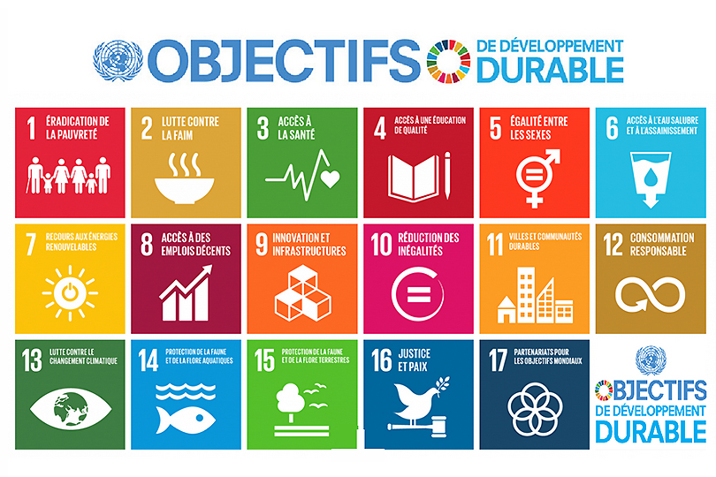
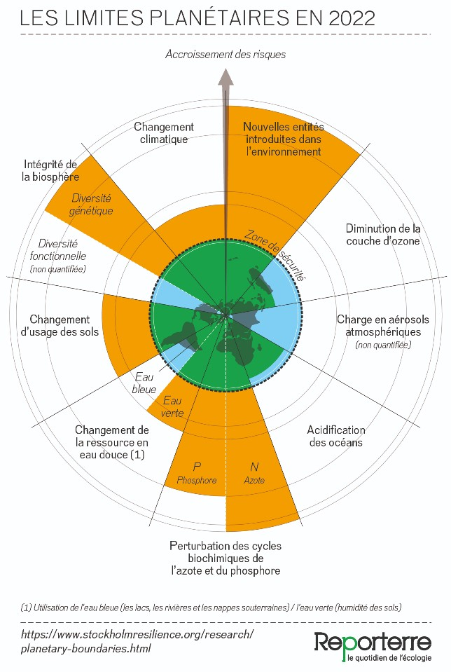
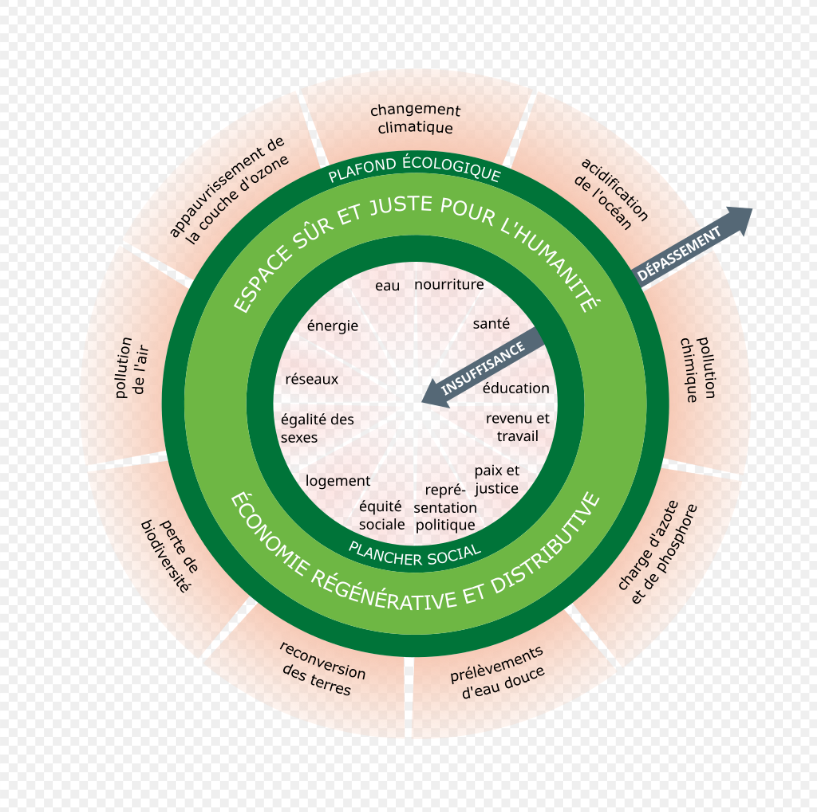

Taux de valorisation des Équipements électriques et électroniques : 89%

Développement Durable : un développement qui répond aux besoins du présent sans compromettre la capacité des générations futures à répondre aux leurs

Définis par l'ONU en tant que 17 objectifs

qui Créé le RSE dans les entreprises

#### Jour de dépassement

[24 Juillet 2025 en France](https://fr.wikipedia.org/wiki/Jour_du_d%C3%A9passement)

Limite Planétaire :

- le changement climatique ;
- l’érosion de la biodiversité ;
- la perturbation des cycles de l’azote et du phosphore ;
- le changement d’usage des sols ;
- le cycle de l’eau douce ;
- l’introduction d’entités nouvelles dans la biosphère ;
- l’acidification des océans ;
- l’appauvrissement de la couche d’ozone ;
- l’augmentation de la présence d’aérosols dans l’atmosphère.

Méthode ERC : Éviter, Réduire, Compenser

- Éviter de prendre ma voiture
- Prendre des gens avec moi en covoiturage
- planter un arbre pour absorber du CO2

### Effet rebond

[NégaWatt](https://fr.wikipedia.org/wiki/Association_n%C3%A9gaWatt)

[ADEME](https://www.ademe.fr/les-futurs-en-transition/)
