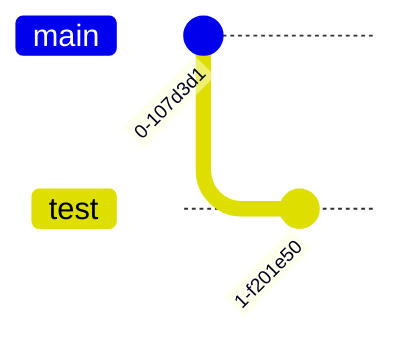

```sh
# Afficher les branches
git branch
# Ajouter la branche test
git branch test
# Changer de branche 
git checkout test
# Véfier la connection a github 
ssh -T git@github.com

```



```mermaid
gitGraph
	commit
	branch test
	commit
	checkout test
```


